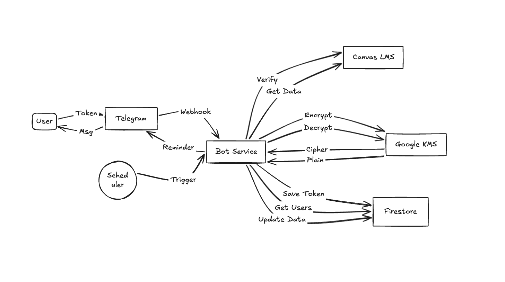

# Canvas Reminder Bot



A high-performance Telegram bot that helps students never miss a Canvas assignment deadline. Built with **FastAPI** on the backend and secured with **Google Cloud KMS** for enterprise-grade token encryption.

## Description

Many students forget assignment deadlines on Canvas, which leads to late submissions and lower grades. Canvas Reminder Bot solves this by automatically syncing with Canvas and sending timely reminders through Telegram — a platform students already use daily. The goal was to build something fast, secure, and easy to use without requiring any manual setup from the user.

The application is live at: [https://canvas.sonungo.com](https://canvas.sonungo.com)

---

## Tech Stack

- **Python 3.11** — core programming language
- **FastAPI** — backend web framework
- **Telegram Bot API** — user communication and reminders
- **Google Cloud Firestore** — database for storing user data
- **Google Cloud KMS** — encryption of user Canvas tokens
- **Google Cloud Run** — containerized deployment
- **Google Cloud Scheduler** — automated reminder scheduling
- **Docker** — containerization
- **HTML & CSS** — landing page and web interface

---

## Features

- **Secure by Design** — Canvas tokens are encrypted using Google Cloud KMS before ever touching the database. Even database administrators cannot access raw tokens.
- **Privacy-Focused** — Sensitive messages (tokens) and media are automatically deleted from the chat after processing.
- **Smart Reminders** — Receive deadline notifications at 24h, 12h, 6h, 1h, and just minutes before your assignment is due. Reminders stop automatically once you submit.
- **No Manual Setup** — The bot syncs directly with Canvas to know exactly when assignments are due and whether they have been completed.
- **Open Source** — The entire codebase is publicly available on GitHub for full transparency.
- **Lightweight & Fast** — Built on FastAPI and Python 3.11 for minimal overhead and quick response times.

---

## How to Run the Project

### Prerequisites

- A Google Cloud Platform account
- Python 3.10 or higher
- A Telegram Bot Token (obtainable from [@BotFather](https://t.me/BotFather))
- The `gcloud` CLI installed and configured

### 1. Google Cloud Infrastructure

**A. Authentication**

```bash
gcloud auth login
gcloud auth application-default login
```

**B. Key Management Service (KMS)**

```bash
# Create the Key Ring
gcloud kms keyrings create canvas-reminder-ring --location global

# Create the encryption Key
gcloud kms keys create canvas-token-key \
    --location global \
    --keyring canvas-reminder-ring \
    --purpose encryption
```

> Note: Ensure your Service Account has the `Cloud KMS CryptoKey Encrypter/Decrypter` role assigned to this key.

**C. Firestore**

Enable **Firestore** (Native Mode) in your Google Cloud Project.

### 2. Environment Variables

Create a `.env` file in the root directory:

```bash
PROJECT_ID=your-google-cloud-project-id
TELEGRAM_BOT_API=your-telegram-bot-token
DATABASE_NAME=your-database-name  # optional, defaults to (default)
```

> Note: No encryption key is stored here. All encryption is handled entirely by Google Cloud KMS.

### 3. Run Locally

```bash
pip install -r requirements.txt
uvicorn main:app --reload
```

The server will be available at `http://127.0.0.1:8000`.

### 4. Deployment (Docker & Cloud Run)

```bash
# Build the container
gcloud builds submit --tag gcr.io/YOUR_PROJECT_ID/canvas-bot

# Deploy to Cloud Run
gcloud run deploy canvas-bot \
    --image gcr.io/YOUR_PROJECT_ID/canvas-bot \
    --platform managed \
    --allow-unauthenticated \
    --region us-central1
```

Configure a Cloud Scheduler job to trigger reminders:

- **URL:** `https://your-cloud-run-url.com/check_reminder`
- **Method:** `POST`
- **Frequency:** `*/5 * * * *` (Every 5 minutes)

---

## How Security Works

This project uses a **Blind Envelope Encryption** strategy to protect user tokens:

1. When a user submits their Canvas token, it is immediately sent to Google Cloud KMS for encryption.
2. KMS returns a ciphertext which is stored in the database. The raw token is never saved.
3. The plaintext token is cleared from memory immediately after encryption.
4. Decryption only occurs during the reminder check process and requires valid Service Account permissions.

This design ensures that even if the database is compromised, the encrypted tokens are completely useless without access to the Google Cloud KMS key.

---

## Team Members

| Name | Role |
|---|---|
| Zhyrgalbek Kalykov | Backend development & Google Cloud deployment |
| Zhyldyzbek Zhalynbekov | UI/UX design, web application & backend development |

---

## Challenges & What We Learned

One of the main challenges was implementing secure token storage. We solved this by integrating Google Cloud KMS, ensuring that sensitive data is never stored in plain form at any point in the system. Another challenge was reliably scheduling reminders across time zones, which we addressed using Google Cloud Scheduler with a 5-minute polling interval.

Through this project, we gained hands-on experience with Google Cloud deployments, secure API integration, and handling sensitive user data responsibly in a production environment.

---

## Future Improvements

- Push notifications for grade updates
- Announcements and course message alerts
- Support for multiple Canvas accounts per user
- A web dashboard for managing reminder preferences

---

## Legal & Privacy

For information on how we handle your data, please review our legal and privacy policy:
[https://canvas.sonungo.com/legal](https://canvas.sonungo.com/legal)
